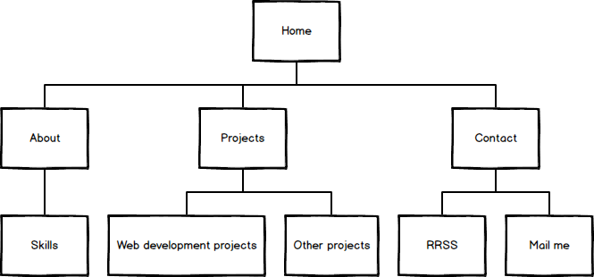
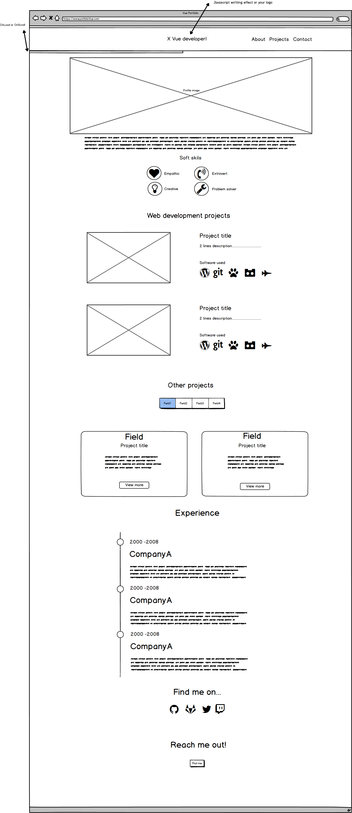

# Vue Portfolio wireframe
### Objetivo
    
    El objetivo principal del proyecto és mejorar la experiencia de ususario para hacer destacar nuestro portfolio.
  
---
### Puntos a destacar 
- Destacar skills con iconografia
- Uso de infografias para que los recruiters puedan visualizar rápidamente con que herrarientas se ha trabajado.
- Plasmar la experiencia laboral en la misma página
- Menu fixed top.
- Hacer la página más dinamica con javascript.

---
## Sitemap

***
A la hora de definir el sitemap del portfolio he decidido concretar apartados y subapartados. La idea principal es plasmar toda la información del portfolio menos los proyectos en una sola página de cara a que los recruiters lo tengan todo en una misma página ypuedan visualizarlo rápidamente, en cambio los proyectos si abriarían en una nueva pestaña utilizando el atributo target="_blank" para enlaces.
***

## Wireframe
